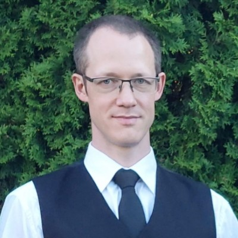

# Hannes Tamme, PhD

{: width=160 style="float:left;border-radius:50%;margin:0 1.5rem .6rem 0;shape-outside:circle()"}

**Private cloud, storage or firewall cluster built to a Minimum Equipment List, delivered running.** The engineer behind Wirt OÜ: OpenStack, Ceph and VyOS on hardware you own. The proof is public — one estate, live since 2016, upgraded through every release since then, never rebuilt. Receipts: [the logbook](../logbook/index.md).

**When to consider me:** if you are among the 10 % who need their infrastructure airworthy, not just running. Otherwise, quite likely the default configuration of academic infrastructure fits you best, since initial design choices are complicated and mistakes are super hard to reverse later. In both cases, the initial assessment brings the price down significantly.

**Four domains, one physics:**

- **Aircraft maintenance, 2006–2011.** Avies Maintenance: Bombardier Learjet 60 and BAE Systems Jetstream 31/32, B1/B2. Trained where failure is not an option and checklists are law. The Minimum Equipment Lists under [Services](../services/index.md) are literal. The term comes from there.
- **Storage and backup, 2011–2016.** NetApp filers, SAN fabrics, data backup. The only proof of a backup is a restore. An untested backup is a rumour.
- **University infrastructure, 2016–.** System administrator at the University of Tartu Institute of Computer Science: infrastructure services (IaaS, SaaS, NaaS). OpenStack since 2016 (Mitaka). Ceph since 2016 (Jewel). The cluster's own monmap says 2016-09-21. Adopted mainly because commercial, supported solutions delivered lower IOPS than expected. VyOS HA firewalls since 2023, out of Equuleus-era necessity: the previous corporate firewall's support price was beyond imagination. All live-upgraded, never rebuilt. Integration is the keyword. The software stack that creates a functional deployment is massive.
- **Doctorate and teaching, 2022–2025.** Estonian University of Life Sciences: doctorate defended 2023 (control and optimization methods for wood drying), junior research fellow 2022–2024, guest lecturer in wood industry automation 2024–2025.

**Degrees:** PhD (2023, Estonian University of Life Sciences), MSc Computer Engineering (University of Tartu), aircraft maintenance (Estonian Aviation Academy), forestry technician (Luua Forestry School). Co-inventor of a registered invention in wood technology. Full public CV: [ETIS](https://www.etis.ee/CV/Hannes_Tamme/eng/), [ORCID](https://orcid.org/0000-0002-9300-7767).

## Company

- Business name: Wirt OÜ
- Register code: 16986693
- IBAN (LHV): EE867700771010370923
- E-mail: [info@wirt.ee](mailto:info@wirt.ee)
- SSH service key: [assets/wirt.keys](https://wirt.ee/assets/wirt.keys)

Wirt OÜ runs deliberately small. A day job of keeping a university institute's infrastructure alive consumes most of my time. Packages, rates and terms: [Hire](../hire/index.md).

Questions, quotes: **[info@wirt.ee](mailto:info@wirt.ee)**.
