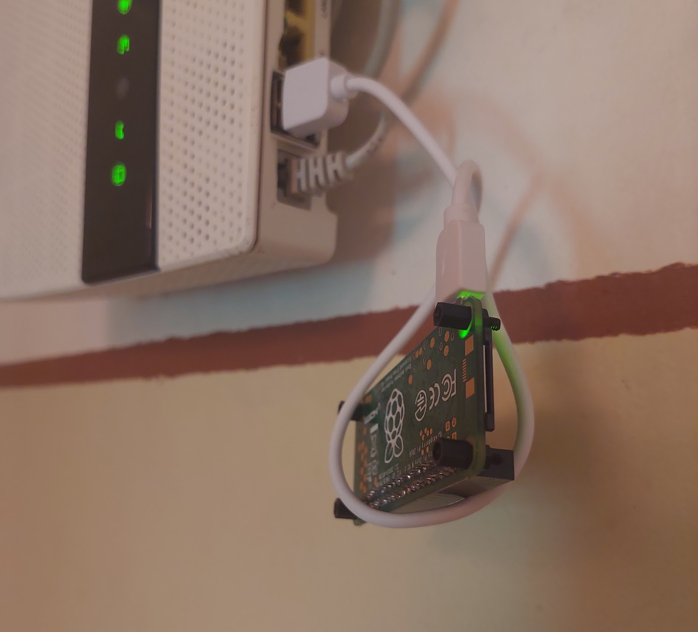

# E-commerce



A minimal e-commerce platform — catalog, coupons, orders, digital delivery — running on a Raspberry Pi Zero, the original one, armv6, 512 MB. It serves a community webshop; the only recurring bill is the domain, about €10 a year. The tunnel, the SSL and the caching are Cloudflare's free tier. The box itself was already in a drawer: its previous job was motor control — six-step BLDC commutation straight from the GPIO pins, stepper drivers, servo positioning.

## Architecture

- Host: Raspberry Pi Zero (armv6l). No public IP, no open ports.
- A Cloudflare named tunnel connects outbound to the edge; SSL is terminated at Cloudflare. The server is never reachable directly.
- Node.js serves the app. The order database is a JSON file. Purchased files are delivered from Google Drive through a view-only service account.
- Cloudflare cache rules keep the hot paths at the edge — `/`, `/preview/*`, `/api/catalog/*`, `/view/*` — so a single-core 512 MB box can survive a catalog browse without touching its own SD card.

## The armv6 problem

Two packages made this harder than it should be:

- Node.js on 32-bit ARM stops at 20.19, with no upgrade path. The app wants ≥18, so it fits — but that ceiling is why this shop will eventually move to a 64-bit board.
- cloudflared has no armv6 build in the default repositories. The arm package from `pkg.cloudflare.com` is built for GOARM=5 and runs on armv6l:

```
LATEST=$(curl -fsSL https://pkg.cloudflare.com/dists/any/main/binary-arm/Packages \
  | awk '/^Version:/{print $2}' | sort -V | tail -1)
curl -fsSL -o cloudflared_arm.deb \
  "https://pkg.cloudflare.com/pool/main/c/cloudflared/cloudflared_${LATEST}_arm.deb"
dpkg-deb -x cloudflared_arm.deb /tmp/cf-extract
install -m 0755 /tmp/cf-extract/usr/bin/cloudflared /usr/local/bin/cloudflared
```

Tunnel setup: `cloudflared tunnel login`, `cloudflared tunnel create <name>`, then install the systemd service with the token from the Cloudflare dashboard (Tunnels tab). The token is a credential — it belongs in the service unit, not in notes or chat windows. At the edge, enable *Always Use HTTPS*.

## Deploy

Code ships by rsync from a build machine; the app runs under systemd from `/opt/shop`:

- Code is root-owned and read-only: `app.mjs`, `lib/`, `public/`, `package.json`.
- A `merchant` service user — no login shell, no home — owns nothing but runtime state.
- Config is `0640 root:merchant` (`.env`, the service-account key). `data/`, `log/`, `cache/` are merchant-owned, `0770`. The app can write state; it cannot rewrite code.

## Orders

Orders land in a JSON file. Everything the shop needs is one jq call:

```
# files of one order
jq -r --arg o "$ORDER" '.[$o].items[].fileName' orders.json

# all orders of one e-mail
jq -r --arg e "$EMAIL" '.[] | select(.email==$e) | .order_reference' orders.json

# all unique e-mails
jq -r '[.[].email] | unique[]' orders.json
```

## Digital goods from Google Drive

Delivery works through the Google Drive API: enable it in the console, create a service account per shop subdomain, give it view permission, drop the key file into the shop config at `0640`.

The same skeleton generalizes to any small service — one system user per subdomain, same directory layout, same permissions:

```
USER="example"
HOME_DIR="/opt/${USER}"
groupadd -r "${USER}"
useradd -r -M -d "${HOME_DIR}" -s /usr/sbin/nologin -g "${USER}" "${USER}"
mkdir -p "${HOME_DIR}"/{config,data,log}
chown root:"${USER}" "${HOME_DIR}"/config; chmod 750 "${HOME_DIR}"/config
chown "${USER}":"${USER}" "${HOME_DIR}"/data;  chmod 750 "${HOME_DIR}"/data
chown "${USER}":"${USER}" "${HOME_DIR}"/log;   chmod 750 "${HOME_DIR}"/log
```

New subdomain, same skeleton, ten minutes.

---

*If you attempt any of this, it is at your own [risk](../disclaimer/index.md).*
